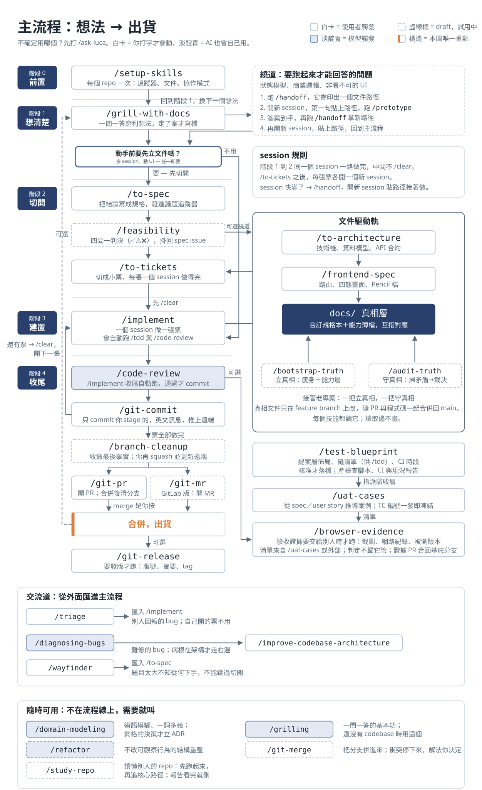
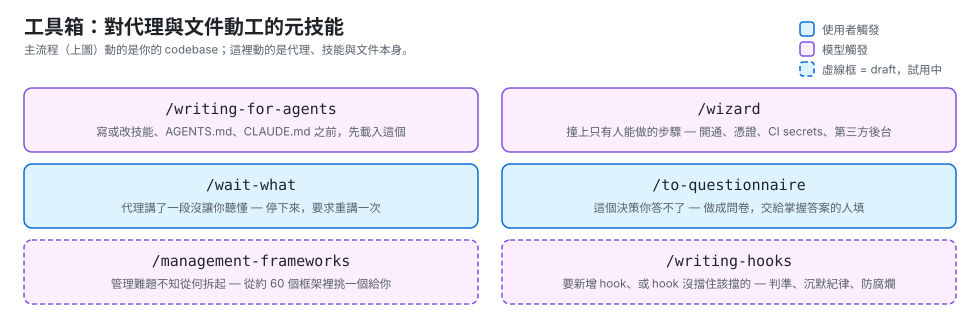

# Luca's Skills

給 AI 編碼代理用的工程技能。每個技能是一個資料夾，`SKILL.md` 是唯一入口。

## 安裝

Windows：

```powershell
.\scripts\install.ps1            # Claude Code（預設）
.\scripts\install.ps1 copilot    # GitHub Copilot
.\scripts\install.ps1 all        # 兩邊都裝
```

Linux / macOS：

```bash
bash scripts/install.sh          # 同樣吃 claude / copilot / all
```

連進該代理的個人技能目錄 —— Claude Code 是 `~/.claude/skills`，Copilot 是 `~/.copilot/skills`。Windows 用 Junction，不需管理員權限；其他平台用 symlink。改這個 repo 的檔案立刻生效。`skills/core/` 與 `skills/draft/` 都會連入 —— draft 是還在試用、尚未畢業的技能，清單見下方[試用中](#試用中draft)。

> Windows 上不要用 Git Bash 跑 `install.sh`：MSYS 的 `ln -s` 會退化成複製目錄，裝出一份不會跟著更新的技能。腳本會擋下來要你改用 `install.ps1`。

### 給 Copilot 用的差異

Copilot 直接讀同一份 `SKILL.md`，不需轉檔（[Agent Skills 是共通格式](https://docs.github.com/en/copilot/concepts/agents/about-agent-skills)）。但有一個行為差異要知道：

**Copilot 不支援 `disable-model-invocation`。** 本 repo 的編排型技能（`implement`、`to-spec`、`to-tickets`、`triage`…）在 Claude Code 只有你打字才會啟動；到了 Copilot，代理判斷吻合時會自己伸手拿。緩解的是這些技能的 `description` 本來就寫成不帶觸發語句的人話摘要，不容易被比對到 —— 但那是降低機率，不是關掉開關。

只想給某個 repo 用而不是全機安裝，把技能資料夾放進該 repo 的 `.github/skills/`、`.claude/skills/` 或 `.agents/skills/` 也可以，三個路徑 Copilot 都讀。

或當作外掛市集掛載（版本凍結，改檔案不會即時生效）：

```
/plugin marketplace add D:\luca-skills
/plugin install luca-skills@luca
```

## 起手式

```
/setup-skills    # 每個 repo 跑一次
/ask-luca        # 不確定該用哪個技能時
```

## 技能

分成兩類，差別只有一個：誰能呼叫它。**使用者觸發**的技能只有你打字才會啟動，它們負責編排流程。**模型觸發**的技能你和代理都能叫，代理判斷任務吻合時會自己伸手拿，它們裝的是可重複使用的紀律。

### 使用者觸發

- **[ask-luca](./skills/core/ask-luca/SKILL.md)** — 問這個情況該用哪個技能、走哪條流程。這個 repo 的技能路由器。
- **[setup-skills](./skills/core/setup-skills/SKILL.md)** — 為這個 repo 設定工程技能所需的組態 — 議題追蹤器與領域文件位置。每個 repo 跑一次。
- **[grill-with-docs](./skills/core/grill-with-docs/SKILL.md)** — 窮追不捨的訪談，磨利一個計畫，並沿路留下紙本軌跡 — 術語表與 ADR。
- **[handoff](./skills/core/handoff/SKILL.md)** — 把當前對話壓縮成一份交接文件，讓全新的 session 能接手這份工作。
- **[to-spec](./skills/core/to-spec/SKILL.md)** — 把當前對話收斂成一份規格，並發佈到議題追蹤器。
- **[to-tickets](./skills/core/to-tickets/SKILL.md)** — 把計畫、規格或對話切成一張張曳光彈票，每張都標明自己的阻塞邊。
- **[implement](./skills/core/implement/SKILL.md)** — 依規格或一組票建置，在議定的接縫上驅動 TDD，收尾跑一次程式碼審查。
- **[triage](./skills/core/triage/SKILL.md)** — 把外來議題推過一台由分診角色組成的狀態機，直到每一張都代理可接手或關閉。
- **[improve-codebase-architecture](./skills/core/improve-codebase-architecture/SKILL.md)** — 勘查程式庫的深化機會，排序後呈上，再對你挑中的那一個進行拷問。
- **[wayfinder](./skills/core/wayfinder/SKILL.md)** — 把龐大而迷霧重重的工程畫成一張決策票地圖，一次解一張，直到通往終點的路清晰為止。
- **[git-commit](./skills/core/git-commit/SKILL.md)** — 檢視已暫存的變更，撰寫英文 commit 並推上遠端。只提交 staged 的內容，絕不代替使用者 stage。
- **[git-pr](./skills/core/git-pr/SKILL.md)** — 開 PR（英文標題＋繁中六段式內文）與合併後清理分支，分支生命週期的頭與尾。
- **[git-release](./skills/core/git-release/SKILL.md)** — 更新版本檔中的版本號，彙整兩版本間的 commit 寫成繁體中文發布摘要，打 tag 推上遠端並發佈 release 頁面。
- **[wait-what](./skills/core/wait-what/SKILL.md)** — 停 — 剛才那段沒讓人聽懂，要求代理重新講一次。
- **[to-questionnaire](./skills/core/to-questionnaire/SKILL.md)** — 把一個你無法獨力回答的決策，做成一份問卷交給掌握答案的人填。
- **[to-architecture](./skills/core/to-architecture/SKILL.md)** — 在規格與拆票之間定架構：技術棧、資料模型、API 合約，直接寫進真相層。
- **[frontend-spec](./skills/core/frontend-spec/SKILL.md)** — 為有 UI 的規格定前端真相：路由表、四態頁面、style tokens 與 `.pen` mockup。
- **[test-blueprint](./skills/core/test-blueprint/SKILL.md)** — 分析專案並提案測試藍圖：層佈局、縫清單、CI 時段，核准後寫入 `docs/test-blueprint.md`。
- **[uat-cases](./skills/core/uat-cases/SKILL.md)** — 從規格推導 UAT 案例清單，發出凍結的 TC 編號 —— `/browser-evidence` 的上游。
- **[browser-evidence](./skills/core/browser-evidence/SKILL.md)** — 把既定案例清單跑成可交付的證據 —— 截圖、網路紀錄與被測版本 manifest，落在 `docs/uat/`。

### 模型觸發

- **[grilling](./skills/core/grilling/SKILL.md)** — 就一個計畫、決策或想法窮追不捨地拷問使用者。當使用者想壓力測試自己的思路、想被質疑一個設計，或說出 "grill"、「拷問我」、「戳破我」這類觸發語時使用。
- **[domain-modeling](./skills/core/domain-modeling/SKILL.md)** — 建立並磨利一個專案的領域語言 — 挑戰模糊術語、拆開超載的詞、把難以回頭的決策寫成 ADR。當問題出在命名、當同一個詞在不同地方意思不同、或當一個決策需要白紙黑字的紀錄時使用。
- **[prototype](./skills/core/prototype/SKILL.md)** — 做一個用完即丟的原型來回答一個設計問題 — 狀態與邏輯用可執行的程式，UI 則做幾個可切換的變體。當一個設計問題在紙上定不下來時使用，也對應 "prototype"、"spike"、「先做個雛形看看」等說法。
- **[tdd](./skills/core/tdd/SKILL.md)** — 測試驅動開發，紅—綠—重構。當要以測試先行的方式建置功能或修 bug、當使用者提到 "TDD"、"red-green"、「紅綠」，或要求寫出能撐過重構的測試時使用。
- **[code-review](./skills/core/code-review/SKILL.md)** — 沿兩條軸審查自某個定點以來的 diff — Standards（有沒有遵守這個 repo 的規範？）與 Spec（有沒有做到票要求的事？）。當使用者要審查一個分支、一個 PR 或進行中的工作時使用，也對應 "code review"、"review this branch"、「審一下」等說法。
- **[diagnosing-bugs](./skills/core/diagnosing-bugs/SKILL.md)** — 對付硬 bug、間歇性失敗與效能回歸的紀律迴圈 — 重現、最小化、立假說、下探針、修好、補回歸測試。當東西壞了而原因不明顯時使用，也對應 "flaky"、"regression"、「時好時壞」、「找不到原因」等說法。
- **[wizard](./skills/core/wizard/SKILL.md)** — 生成一支互動式 bash 精靈，一步步引導人類完成只有人能做的步驟。當要開通基礎設施、設定憑證或 CI secrets、走一遍陌生的第三方後台、或跑一次性的遷移／切換時使用。代理自己能做的步驟不要用它。
- **[writing-for-agents](./skills/core/writing-for-agents/SKILL.md)** — 撰寫給代理讀的文件的通用工法：context pointer、兩種負載、資訊階梯、completion criteria。建立或編輯技能、修改 `CLAUDE.md` 時使用。

### 試用中（draft）

還沒畢業的技能 —— 安裝會一併連入、已可呼叫，但內容仍在真實使用中修訂，隨時可能改動或撤下。用滿試用期、內容修過至少一輪才會搬進上面的正式清單：

- **[audit-truth](./skills/draft/audit-truth/SKILL.md)** — 持續性稽核刀：掃真相層找語意矛盾（文件↔程式碼、文件↔文件），問卷裁決後寫進漂移總帳；宿主已有帳本就寫宿主格式。
- **[bootstrap-truth](./skills/draft/bootstrap-truth/SKILL.md)** — 一次性正規化刀：在宿主既有治理的形狀內把文件瘦身變準、補業務能力薄檔、標上能力對應；砍字與改事實分開 commit。
- **[briefing](./skills/draft/briefing/SKILL.md)** — 把簡報圖變成上台用的口頭講稿＋導讀：結論先行、節間串場、預期質詢與建議答法，寫成 `briefing.md`。
- **[caveman](./skills/draft/caveman/SKILL.md)** — 聊天回覆切換為繁中電報體，砍廢話省輸出 token；程式碼、commit、文件照常散文。
- **[diagram](./skills/draft/diagram/SKILL.md)** — 依受眾與情境挑選最合適的圖表並繪製，缺資訊時先畫草稿再問。
- **[feasibility](./skills/draft/feasibility/SKILL.md)** — 在規格與拆票之間補上可行性判決（✅／⚠️／❌），以 comment 掛回 spec issue。
- **[git-merge](./skills/draft/git-merge/SKILL.md)** — 把指定分支合併進當前分支；衝突時停下來分析與建議，解法是使用者的決定。
- **[git-mr](./skills/draft/git-mr/SKILL.md)** — GitLab 版 git-pr：開 MR（有 glab 直建，沒有就給連結、標題、內文自己貼）與合併後清理分支。
- **[management-frameworks](./skills/draft/management-frameworks/SKILL.md)** — 管理框架知識庫與診斷：OKR、精實、六標準差、Scrum 等的選用判準。
- **[refactor](./skills/draft/refactor/SKILL.md)** — 不改變可觀察行為的結構重整：特徵測試護網、一次一個 transform、綠燈即提交。
- **[study-repo](./skills/draft/study-repo/SKILL.md)** — 讀懂一個第三方 repo：先跑起來、追一條核心路徑，產出拋棄式的學習報告。
- **[svg-palette](./skills/draft/svg-palette/SKILL.md)** — SVG 繪圖的色盤與用色規則 —— 預設靛青深淺＋橘強調，可套品牌色。
- **[writing-hooks](./skills/draft/writing-hooks/SKILL.md)** — 撰寫與審查 Claude Code hook 的判準：什麼規則該降到 hook、怎麼防靜默腐爛。

## 主流程

[](./assets/flow.svg)

哪個階段用哪個技能：

| 階段 | 做什麼 | 怎麼做 |
| --- | --- | --- |
| 0・前置 | 告訴技能們議題追蹤器與領域文件在哪 | `/setup-skills`，每個 repo 只跑一次 |
| 1・想清楚 | 一問一答把想法磨到可以動手 | `/grill-with-docs`（還沒有 codebase 時用 `/grilling`） |
| 1・繞道 | 有問題要跑起來才能回答 | ① `/handoff` 拿文件路徑 → ② 開新 session 貼路徑，跑 `/prototype` → ③ 答完再 `/handoff` 拿新路徑 → ④ 開新 session 貼路徑，回主流程 |
| 2・切開 | 一個 session 做不完，先切小 | `/to-spec` →（動到架構或 UI 才跑 `/to-architecture`、`/frontend-spec`）→ `/to-tickets` |
| 3・建置 | 一個 session 做一張票 | `/clear` → `/implement` 指定一張票（會自動跑 `/tdd` 與 `/code-review`）→ 還有票就回到 `/clear` |
| 3.5・驗收 | 證據要交給別人簽核時才走 | 專案第一次先 `/test-blueprint` 定測試藍圖 → `/uat-cases` 產凍結編號的案例 → `/browser-evidence` 跑成截圖與網路紀錄 |
| 4・收尾 | 審查、提交、開 PR 到合併出貨 | `/code-review`（`/implement` 收尾自動跑）→ `/git-commit` → `/git-pr`（GitLab 用 `/git-mr`，試用中）→ 要發版才跑 `/git-release` |

session 規則：

- 階段 1 到 2 在同一個 session 一路做完，中間不 `/clear`。
- `/to-tickets` 之後，每張票各開一個新 session。
- session 快滿了就 `/handoff`，開新 session 貼上路徑接著做。

交流道 — 不從階段 1 開始的三種進場：

| 起點 | 匯入 | 什麼時候 |
| --- | --- | --- |
| `/triage` | `/implement` | 別人回報的 bug 與需求。自己用 `/to-tickets` 開的票直接 `/implement`。 |
| `/diagnosing-bugs` | `/improve-codebase-architecture` | 難修的 bug。修完發現病根在架構，才走這條。 |
| `/wayfinder` | `/to-spec` | 題目大到不知從何下手。出來後接 `/to-spec`，不能直接跳 `/implement`。 |

名詞卡住時，隨時可用 `/domain-modeling`（術語模糊、一詞多義、決策要留紀錄）與 `/grilling`（一問一答的基本功）。不確定用哪個，打 `/ask-luca`。

## 工具箱

不在主流程線上的元技能 — 動工對象是代理與文件本身，不是你的 codebase：

[](./assets/toolbox.svg)

## 參考來源

這些技能不是憑空發明的。移植來源與設計依據：

- [mattpocock/skills](https://github.com/mattpocock/skills) — 上游。多個技能的原始出處；其 issue 區的實測回報（技能依賴寫成散文會隨機失效、共享狀態雙寫者必漂移、spec 是做完即丟的交付紀錄）直接塑造了本 repo 的依賴規則與鷹架生命週期。移植文字的授權聲明見 [THIRD-PARTY-NOTICES.md](./THIRD-PARTY-NOTICES.md)。
- [github/spec-kit](https://github.com/github/spec-kit) — spec 驅動開發的參照系；「模板是 AI 的輸出合約」與「鷹架文件出貨即刪」的實務依據。
- [Fission-AI/OpenSpec](https://github.com/Fission-AI/OpenSpec) — 規格流程研究的對照組。
- [bmad-code-org/BMAD-METHOD](https://github.com/bmad-code-org/BMAD-METHOD) — 多代理流程與模板設計的對照組。
- [eyaltoledano/claude-task-master](https://github.com/eyaltoledano/claude-task-master) — 任務分解與切票研究的對照組。
- [JuliusBrussee/caveman](https://github.com/JuliusBrussee/caveman) — 電報體回覆技能（caveman）的概念來源（分割授權：skill 部分 MIT，proxy 引擎 BSL-1.1 未取用；文字全部重寫）。只取輸出端 skill 的規則骨架——否定詞護欄、持久化豁免、tokenizer 紀律；輸入端 proxy 與 Pixel Mode 經評估不取（破壞 prompt cache、61% 為本地估算非帳單實測）。

驗收測試技能（uat-cases、browser-evidence）的設計依據：

- [Kubernetes conformance tests](https://github.com/kubernetes/community/blob/master/contributors/devel/sig-architecture/conformance-tests.md) 與 [web-platform-tests](https://web-platform-tests.org/) — 穩定測試編號的業界先例：測試變成第三方消費的合約時，ID 才需要凍結——凍結編號紀律的同構物。
- IEEE 829（測試案例規格欄位：輸入、預期輸出、前置條件缺一不可，否則只是導覽）與 ISTQB 七原則＋黑箱技法（窮舉不可能，測試是抽樣——負向案例紀律的依據）。
- [obra/superpowers](https://github.com/obra/superpowers) — verification-before-completion 的證據語言紀律（沒有新鮮證據不准聲稱通過；should／probably 是紅旗）。
- [ooiyeefei/ccc](https://github.com/ooiyeefei/ccc) — 生態圈最接近的 UAT skill 對照組；continue-on-failure 與 console 錯誤擷取的實務依據。
- Barr et al.、[The Oracle Problem in Software Testing: A Survey](https://earlbarr.com/publications/testoracles.pdf)（IEEE TSE 2015）— 期望結果必須執行前寫死且具體到可判；弱 oracle 默默封頂測試能偵測的東西。

## 維護

```bash
bash scripts/check.sh
```

一致性規則全部由這支腳本強制，CI 每次 PR 都跑。詳見 [CLAUDE.md](./CLAUDE.md)。
